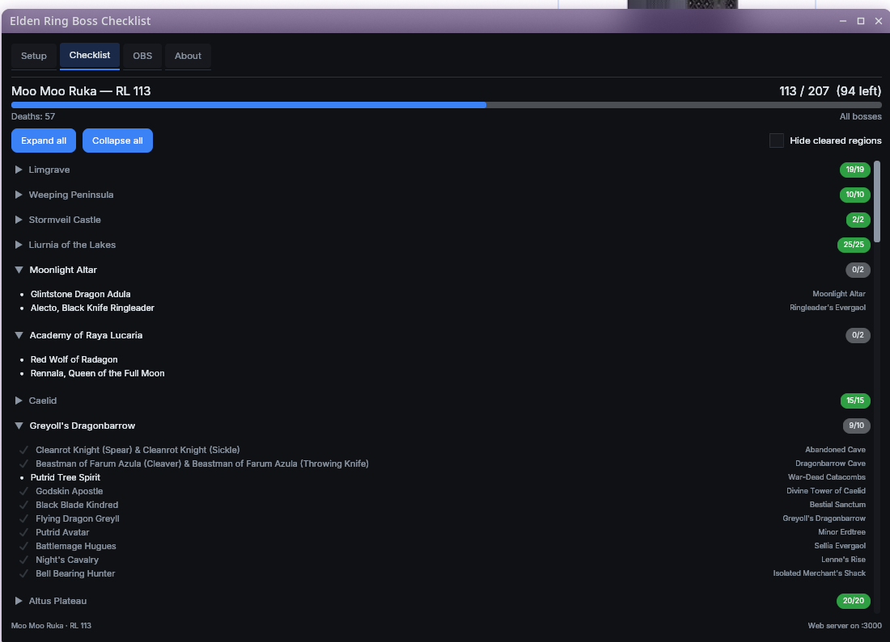

# Elden Ring Boss Checklist

A native boss kill tracker for Elden Ring, with three ways to get your progress
into OBS. Reads your save file (**read-only**) to work out which bosses you've
beaten — safe to use with EAC.



## Features

- Native desktop app on Windows and Linux — no browser needed to use it
- Detects boss kills from your save file (**read-only**), while you play
- Finds your saves for you, including Proton prefixes, Flatpak Steam and
  Seamless Co-op
- Multiple boss lists: all bosses, main story, remembrances, great runes, DLC,
  hardlock
- Reads your death count and character level
- **Attempt counter** — deaths since your last boss kill, reset automatically
  when the next one falls
- **Session totals** — bosses and deaths for this sitting
- **Boss defeated banner** — the overlay names the boss for a few seconds when
  it dies
- Remembers your setup — save file, character, boss list, window size, theme,
  and which tab you were on — between restarts
- Elden Ring colour theme by default (Dark, Light and follow-the-OS also
  available), with an adjustable text size
- **Two ways into OBS**:
  - **Browser source** — paste a URL, the way every OBS overlay works. Either
    the whole card in one source, or a page per value to scatter round your
    layout. Styled here, updates live
  - **Text files** — plain text files for OBS "Text (GDI+/FreeType)" sources
    set to *Read from file*. Works on any OBS version, no browser source

- Mobile companion page for single-monitor players

## Building

Requires the [Odin compiler](https://odin-lang.org/) (a recent nightly — the
app uses the merged `core:os` API), plus what Skald needs:

- **Vulkan loader and driver** — `libvulkan1` + `mesa-vulkan-drivers` on Linux;
  bundled with any modern GPU driver on Windows
- **SDL3** — `libsdl3-0` on Linux; Odin's `vendor:sdl3` ships `SDL3.dll` on
  Windows

The GUI framework, [Skald](https://github.com/BuLEEto/Skald), is vendored at
`vendor/skald/` — nothing to fetch.

### Linux

```bash
make build      # build ./er-boss-checklist
make run        # build and run
make tar        # release tarball, with libSDL3.so.0 bundled alongside
make deb        # .deb that depends on the distro's libsdl3-0
```

### Windows

From a Developer Command Prompt (MSVC on PATH):

```cmd
odin build . -collection:gui=vendor/skald -o:speed -out:er-boss-checklist.exe
copy "%ODIN_ROOT%\vendor\sdl3\SDL3.dll" .
```

Cross-compiling from Linux doesn't work — SDL3 and Vulkan link through MSVC
import libraries.

See [BUILD.md](BUILD.md) for the full setup, including distros that don't
package SDL3 yet.

## Usage

Run the app. On first launch:

1. **Setup** tab → **Choose save file…**. A picker opens and searches every
   Steam library it can find — including Proton prefixes, Flatpak Steam and
   Seamless Co-op — reads each save, and lists the characters in it. Click a
   character to start tracking it. **Browse…** is there if your save lives
   somewhere unusual.
2. Pick a boss list if you want something other than all bosses.
3. **Checklist** tab shows progress; it updates itself while you play.

Text feeling small? **Setup → Text size**. It scales the whole interface, not
just the type.

The save-file check runs every 5 seconds by default. That's also the floor —
Elden Ring writes its save on its own schedule, so polling faster can't surface
a kill any sooner. Each check is just an mtime comparison; the save is only
re-read when it actually changed.

Everything you choose is saved immediately to your config directory, so the
app comes back the way you left it:

| | |
|---|---|
| Linux | `~/.config/er-boss-checklist/settings.json` |
| Windows | `%APPDATA%\er-boss-checklist\settings.json` |

The **About** tab shows the exact path.

## OBS

The **OBS** tab has one panel per thing you'd actually add to a scene:

| Panel | What it is |
|---|---|
| **Overlay card** | Everything in one box. One Browser source, one URL. What most people want, and the cheapest — a single browser instance. |
| **Single values** | A page per value, each its own Browser source, for layouts where the numbers live in different corners. Styled together or one at a time. |
| **Text files** | Plain files that OBS text sources read. Works on any OBS version, costs nothing, and other tools can read them too. |

Earlier versions also drove OBS over **obs-websocket**, creating the sources for
you. That's gone. It never showed anything the browser sources couldn't — in its
last form it was literally creating browser sources pointed at these same pages
— and presenting it alongside them made the tab read as competing ways to do one
job. Copying a URL into a Browser source is the thing every OBS user already
knows how to do, so that's all there is now.

Each panel has a **? How do I use this** button with step-by-step OBS
instructions: which source type to add, where the setting lives, what each
value is.

**Region** and **Appearance** belong to the page, not to the app — so the
overlay card can sit on Caelid in gold while the single-value pages show Altus
Plateau at 64px and the text files follow the first unfinished area. That's
usually what you want when more than one is on screen, since you'd rarely show
the same thing twice.

### Overlay card

Leave *Run the web server* on, pick your overlay mode (summary / next up /
region) and background, then copy the URL into an OBS **Browser Source**. The
page updates live over server-sent events — no refresh interval to tune.

Everything in one box, one source. What most people want, and the cheapest —
a single browser instance.

The card **fills the browser source**, so the box you drag in OBS is the card
you see — size the source to the size you want the card.

**Card** chooses what's behind the text:

| | |
|---|---|
| **Dark panel** | The rounded box. Easiest to read, but it's a visible box on your scene. |
| **No panel** | Just the text, with a heavy outline so it survives over gameplay. |

That's a different setting from **Background**, which is the chroma-key colour
behind the whole page and only matters if you capture this as a *window* rather
than using a Browser source. Leave Background on Transparent unless you're doing
that — "Transparent" there has never meant "no panel", which caught me out too.

In summary mode, **Hide cleared areas** drops the areas you've finished. A full
boss list is over thirty areas, which is more than fits in a sensibly sized
source — if the bottom of your summary is cut off, this is the fix.

### Single values

A page per value — progress, attempts, next boss, deaths, session, character,
region, region bosses — listed as a table with **Copy URL** and **Style…** on
each row. Each goes into OBS as its own Browser source, for layouts where the
numbers live in different corners rather than gathered in a card. Add only the
ones you'll use; each is a browser instance.

Each page draws **flush to the top-left corner**, so crop the source tight to
the text — a bare number needs very little, while Character or Next boss want
width for a long name and Region bosses wants height for a list. A source left
far bigger than its text is what makes these awkward to position.

**Caption above each value** is on by default: "DEATHS" above the number, and so
on. A bare `57` on a stream tells a viewer nothing. Turn it off if you're drawing
your own labels in OBS.

The URLs carry nothing but the page's type, and are shown in each page's
**Style…** dialog rather than in the list — eight of them differing only in the
last word is a column of noise. Everything about how a page looks is resolved by
the app, so restyling reaches a source that's already in OBS on its own; you
never re-paste a URL you've already set up.

**Styling one on its own.** *Appearance* at the bottom of the panel styles every
page at once. To make one different, press **Style…** on its row and tick *Style
this page on its own*: it starts as a copy of the shared look and then goes its
own way. Untick to put it back on the shared one — what you set is kept, so you
can flip between the two.

It's whole-look, not per-setting. A page either follows the shared look or has
one entirely of its own. Per-setting inheritance would need every control to
carry a third "not set" state, and *why didn't that one change?* is a worse
question to be stuck with than *this page is styled on its own*.

### Regions and appearance

**Region** decides which area a panel shows. Each panel has its own:

| | |
|---|---|
| *Auto — where I last killed* | Tracks the area your most recent kill happened in, so it follows you around. The save records only *that* a boss is dead, never when — so this counts kills the app was open for. Falls back to first-unfinished until it's seen one, and again once that area is cleared. |
| *Auto — first unfinished* | The first area with anything left, in list order. |
| A region by name | Pinned. Everything stays there until you change it. |

A pin puts `&region=N` in the copied overlay URL so the browser source agrees.
The automatic modes deliberately leave it off — the server then resolves the area
on every request, so the page keeps following instead of freezing on whichever
area was current when you copied the URL. The pin is stored by name, so
switching boss lists can't silently repoint it at a different area.

**Appearance** styles the pages this app serves — accent colour, text colour,
size, font family, outline, alignment, plus an **Advanced — custom CSS** box for
anything else. The overlay card has its own; the single-value pages share one,
which any of them can override.

**Font** lists the families installed on this PC (via fontconfig on Linux, GDI
on Windows), filtered as you type. It's also free-form: OBS renders the page, so
if OBS runs on a different machine, type the font name as it's spelled *there*.
The first entry clears the setting and leaves the page on its own font stack.

Styling lives here rather than being left to OBS for a specific reason: OBS's
Custom CSS box belongs to a *single source*. With nine possible sources, theming
through OBS means pasting the same rules nine times, and again on every tweak.
OBS's box still works and still wins — it's injected after ours — which makes it
the right place for a one-off override on one source.

**Align** switches the whole overlay between left and right. Worth knowing why
it lives here and not on the text sources: OBS's own text sources have no text
alignment and no line-height control, so a multi-line list is stuck left-aligned
whatever you do with the scene item's bounding box — that only moves the block,
not the lines inside it. The overlay is a web page, so alignment is one CSS
rule.

Keep the background **Transparent** for a browser source.

### Recolouring the overlay

The page's colours are CSS custom properties, so OBS's **Custom CSS** box (in
the browser source's properties) repaints the whole thing:

```css
:root { --gold: #ff4444; --text: #ffffff; }
```

The variables are `--gold`, `--gold-dim`, `--text`, `--text-dim`, `--red` and
`--green`. The app never writes to that box, and never resends the source's
width or height after creating it, so your styling and sizing survive. The green and magenta
options exist for people capturing the page as a window instead, where a
transparent background isn't possible and you need a chroma key.

### Attempts, sessions and the kill banner

**Attempts** is the number of deaths since the last boss you killed, and it
resets itself the moment the next one falls. Elden Ring doesn't record deaths
per boss anywhere in the save, so that is exactly what it counts — a death
exploring, to a fall, or to an invader lands in it too. It's the number souls
streamers usually mean by "attempt 38", but it's an inference, not a per-boss
stat. There's a **Reset attempts** button on the Checklist tab.

**Session** is bosses and deaths for this sitting. It starts again each time you
open the app, and has its own reset.

Both are bookmarked per character, so switching character doesn't subtract one
Tarnished's deaths from another's.

**Boss defeated banner** announces the boss by name on the overlay browser
source for a few seconds, then goes back to the numbers. It sits at the bottom
of the source, so leave that source some height below the card or the two will
overlap. It uses the Browser source panel's accent and text colours, and can be
turned off.

Everything here comes from the save file, and the game only writes that every so
often — so expect a kill to show up within about ten seconds of the fight
ending, not the instant the boss falls.

### Text files

Turn on *Write text files* and point OBS **Text (GDI+)** / **Text (FreeType 2)**
sources at them with *Read from file* ticked. No browser source, no extra CPU,
works on every OBS version:

| File | Contents |
|---|---|
| `progress.txt` | `113 / 207 bosses` |
| `killed.txt` / `total.txt` / `remaining.txt` | just the number |
| `percent.txt` | `54%` |
| `deaths.txt` | death count |
| `attempts.txt` | deaths since your last boss kill |
| `session.txt` | `2 bosses · 31 deaths` for this sitting |
| `character.txt` | `Moo Moo Ruka — RL 113` |
| `next_boss.txt` | the next boss still standing |
| `next_bosses.txt` | the next few, one per line |
| `region.txt` | first unfinished region and its count |
| `region_bosses.txt` | what's left in that region, one per line |
| `regions.txt` | every region and its count, one per line |

### Mobile companion

Handy on a single monitor: open the mobile URL from the OBS tab on your phone.

### While you play

Minimising the window doesn't stop any of it. The web server, the save polling,
the text files and the served pages all keep running — only the drawing
stops. The window idles at 0 fps and repaints solely when something changes, so
leaving it open costs you effectively nothing.

### Save File Locations

**Windows:**

```
%AppData%\EldenRing\<steam_id>\ER0000.sl2
```

**Linux (Steam/Proton):**
```
~/.steam/steam/steamapps/compatdata/1245620/pfx/drive_c/users/steamuser/AppData/Roaming/EldenRing/<steam_id>/ER0000.sl2
```

For Seamless Co-op, the file is `ER0000.co2` under the mod's app ID instead of `1245620`.

## Source Code Overview

| File | Purpose |
|------|---------|
| `main.odin` | Startup: load data, settings, server, hand off to the GUI |
| `gui.odin` | GUI state, messages, update — the only writer of shared state |
| `gui_view.odin` | GUI layout for all four tabs |
| `app_state.odin` | Shared state and its threading contract |
| `settings.odin` | Config-directory settings, with migration from older builds |
| `server.odin` | Web server for the OBS overlay and mobile page |
| `obs_text.odin` | Text-file output for OBS text sources |
| `widgets.odin` | The single-value pages: which exist, and what each shows |
| `fonts*.odin` | System font enumeration for the font picker |
| `save_parser.odin` | Elden Ring save file parser (sequential binary format) |
| `save_scan.odin` | Steam library / Proton prefix save discovery |
| `theme.odin` | Elden Ring palette and the text-size scale |
| `gui_help.odin` | In-app help sheets for each OBS panel |
| `boss_data.odin` | Boss list loading and filtering |
| `platform_*.odin` | LAN IP detection, per platform |
| `src/libs/http/` | HTTP server library |
| `vendor/skald/` | Skald GUI framework (vendored, zlib) |
| `bosses.json` | Boss definitions with event flag IDs |
| `hardlock.json` | Hard-lock boss progression data |
| `eventflag_bst.txt` | Event flag BST lookup table |
| `templates/`, `static/` | Overlay and mobile pages |

The parser was built by cross-referencing three independent format
implementations.

See [THIRD_PARTY.md](THIRD_PARTY.md) for full credits and licenses.

## Safety

This application **never writes to your save file**. It opens the file in read-only mode to check event flags. It should not trigger any anti-cheat detection.

## Disclaimer

- Elden Ring Boss Kill Tracker is provided "as is" without warranty of any kind, express or implied.
- We are not liable for any loss of data, emotional distress, or damages arising from the use of this application.
Liability
- To the fullest extent permitted by law, the developer shall not be liable for any indirect, incidental, special, consequential, or punitive damages arising from your use of Elden Ring Boss Kill Tracker is provided.
- This includes but is not limited to loss of data, loss of profits, or damages resulting from its use.
Changes
- These terms may be updated at any time. Continued use of the application constitutes acceptance of any changes.

## License

MIT
